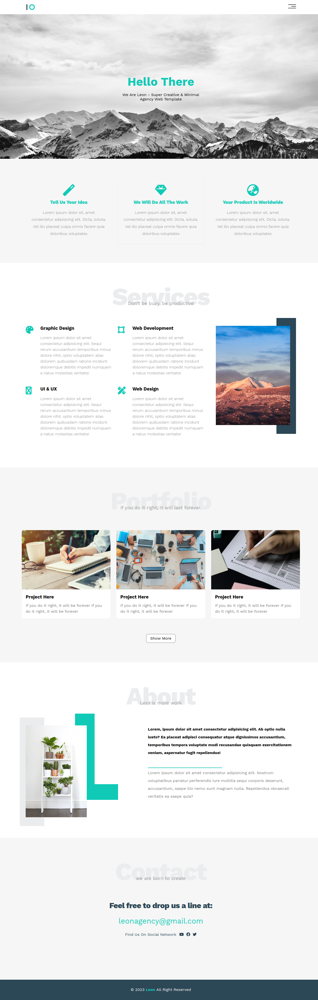
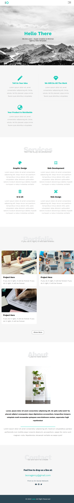
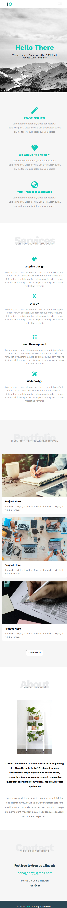

# Leon - Agency Template

## **Introduction**

*This README file provides essential information and guidance for using and customizing the Leon website template. This template is designed to create a personal portfolio or a simple personal website. It showcases your projects, skills, and provides a platform to introduce yourself to the online world.*

## [Live Demo](https://leon-self.vercel.app/) to see the live version of the template.

## **Features**
* Simple and elegant design.
* Responsive layout, suitable for desktop, tablet, and mobile devices, *The screens on different devices are below*.
* Utilizes ***Grid*** and ***Flexbox*** for flexible and responsive web design.
* Portfolio section to showcase your projects.
* About Me section to introduce yourself and share your background.
* Contact bar for visitors to get in touch with you.

## **Getting Started**
To use this template, follow these steps:

1. Clone or download the repository to your local machine.

    Use the following command:

    `git clone https://github.com/mdawoud27/frontendProjects-Templates.git`

2. Navigate to the ***Template-01*** directory.

3. Open the `index.html` file in your web browser to see the default template.

## **Customization**

**The template is designed to be easily customizable to fit your specific needs**.

### Screens On Different Devices
*Screens are not fully exactly.. try the live version from [here](https://leon-self.vercel.app/)*
* Large Screens - *desktop*

    
    
* Meduim Screens - *tablet*

    

* Small Screens - *mobile*

    

## **Deployment**

To deploy your customized website, you have several options:

1. Use a static website hosting service like ***GitHub Pages***, or [***Vercel***](https://vercel.com/).
2. Host the website on your own server.

## **Browser Compatibility**

The template has been tested on the following web browsers:

* Google Chrome
* Mozilla Firefox
* Microsoft Edge
* Safari

## **Credits**

This website template was created by **Leon - Agency Template**. You can find the template [*here*](https://www.graphberry.com/item/leon-psd-agency-template).